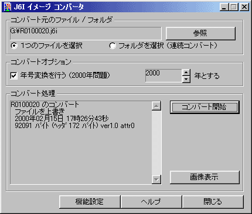

##  J6I イメージコンバータ for RICOHデジカメDC-1/DC-2 for Windows<!-- omit in toc -->

---
[Home](https://oasis3855.github.io/webpage/) > [Software](https://oasis3855.github.io/webpage/software/index.html) > [Software Download](https://oasis3855.github.io/webpage/software/software-download.html) > [image-tools](../README.md) > ***j6i2jpg*** (this page)

 
 

Last Updated : Mar. 2000 -- ***this is discontinued software 開発終了***

- [ソフトウエアのダウンロード](#ソフトウエアのダウンロード)
- [機能の概要](#機能の概要)
  - [制限事項](#制限事項)
- [動作環境](#動作環境)
- [バージョンアップ履歴](#バージョンアップ履歴)
- [主な掲載雑誌](#主な掲載雑誌)
- [ライセンス](#ライセンス)

 
 

## ソフトウエアのダウンロード

-    [このGitHubリポジトリを参照する](../j6i2jpg/download/) 

-    [Googleドキュメントを参照する](https://drive.google.com/drive/folders/0B7BSijZJ2TAHNzVmZjQ0M2UtYTAyYi00YjQ5LTg5YjQtMjc3ZGJjNWY5NDNh?resourcekey=0-KAQmh4Mzs73kci9uJEXQPw) 

 
 

## 機能の概要

RICOH製デジタルカメラ DC-1/DC-2シリーズ（1997年ごろの製品) のJ6I形式画像ファイルをJPEGファイルに変換するするソフトウエア。    メーカ純正の「PC接続キット」を購入せずに、PCMCIAメモリーカード内のJ6Iデータを扱えるようになります。

JEIDA規格のヘッダ領域は次の図のようなもので、このソフトウエアでは、ヘッダおよびファイル長の統一のために加えられている余分な領域を削除します 

### 制限事項

このソフトウエアはシングルスレッドで作成されていますので、画像変換処理中は処理ウインドウの表示が更新されません。 

 
 

## 動作環境

- Windows 98/NT/2000で動作確認済み 

 
 

## バージョンアップ履歴

- Version 1.0 (1997/05/01)

  - 新規作成 （RICOH DC-2L購入のため） 

- Version 1.1β (1999/03/01)

  - [NEW] 連続変換のダイアログを共通ダイアログに変更（正常に機能せず） 

- Version 1.8 (2000/03/07)

  - [Bug Fix] 連続変換ダイアログのバグ修正 
  - [NEW] 保存先のダイアログを共通ダイアログに変更 
  - [NEW] インストール、アンインストールを装備 
  - [NEW] 年号強制変換（2000年問題対応） 
  - [NEW] ダイアログを表示せずに変換・プレビュー 
  - [NEW] ファイルの関連付けを自動化 
  - [NEW] JPGファイルのプレビューを、標準で関連付けられたプログラムで行える 

 
 

## 主な掲載雑誌

- ホームページデザイン (エーアイ出版) 
- ウインドウズ・パワー（アスキー） 

 
 

## ライセンス

このソフトウエアは [GNU General Public License v3ライセンスで公開する](https://gpl.mhatta.org/gpl.ja.html) フリーソフトウエア

※ 配布ソースコード等に書かれているライセンス条項は撤回し、上述GNU General Public License v3ライセンスにて配布する。
