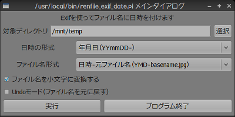
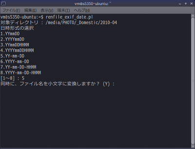

Exifデータによるjpegファイル名変更 Perlスクリプト<br/>
Manipulate jpeg file name renamer by Exif data   for Linux and BSD

---

- [機能の概要](#機能の概要)
  - [GUI モード](#gui-モード)
  - [コンソール モード](#コンソール-モード)
  - [このスクリプトを利用せず、Linux標準コマンドのみで行う場合](#このスクリプトを利用せずlinux標準コマンドのみで行う場合)
- [バージョン履歴](#バージョン履歴)
- [ライセンス](#ライセンス)


## 機能の概要

jpegファイルのExifデータを用いて、ファイルの名前を変換するツール。

### GUI モード

起動時に-guiオプションを付ける ```  renfile_exif.pl -gui ``` ことで、GUIモードで起動する



GUIモードでの開始画面


GUIモードでの処理プレビュー画面

### コンソール モード



コンソール モードでの開始画面

### このスクリプトを利用せず、Linux標準コマンドのみで行う場合

ファイル名にExif日時文字列を付け加える(参考マニュアル：[exiftool 公式doc:RENAMING EXAMPLES](https://exiftool.org/exiftool_pod.html#RENAMING-EXAMPLES) および  [Writing "FileName" and "Directory" tags](https://exiftool.org/filename.html))

```
exiftool '-FileName<CreateDate' -d %%f_%Y%m%d_%H%M%S.%%e dir
```

ファイルのタイムスタンプをExifの日時に変更する

```
jhead -ft [ファイル名]
```
```
exiftool -overwrite_original "-FileModifyDate<Exif:CreateDate" [ファイル名|ディレクトリ名]
```

jpegファイル内のExif時間をずらす（カメラの時差設定が間違っていた場合など。例は時刻を8時間戻す場合）

```
jhead -ta-8:00 [ファイル名]
```

## バージョン履歴

- Version 0.2（Linux/BSD版） 2010/12/06

    - 当初バージョン（Gtk2のGUI化） 

- Version 0.3（Linux/BSD版） 2011/01/04

    - 日本語のディレクトリ名、ファイル名に対応強化 

- Version 0.4（Linux/BSD版） 2011/01/05

    - ファイル名形式の選択、Undoを実装 
    - Windowsでも実行可能（日本語対応可能）に最適化 

- Version 0.5（Linux/BSD版） 2011/01/07

    - ファイル改名時に同一ファイル名となった場合異常終了する問題を修正 

## ライセンス

このスクリプトは [GNU General Public License v3ライセンスで公開する](https://gpl.mhatta.org/gpl.ja.html) フリーソフトウエア

