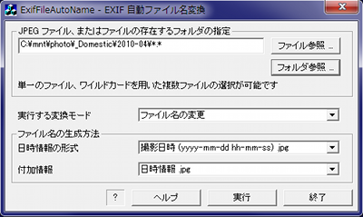

## Exifデータによるjpegファイル名変更・タイムスタンプ変更 Manipulate jpeg file name and time stamp by Exif   for Windows<!-- omit in toc -->

---
[Home](https://oasis3855.github.io/webpage/) > [Software](https://oasis3855.github.io/webpage/software/index.html) > [Software Download](https://oasis3855.github.io/webpage/software/software-download.html) > [image-tools](../README.md) > ***renfile-exif-win*** (this page)

 
 

Last Updated : Aug. 2007 -- ***this is discontinued software 開発終了***

- [ソフトウエアのダウンロード](#ソフトウエアのダウンロード)
- [機能の概要](#機能の概要)
- [インストール方法・アンインストール方法](#インストール方法アンインストール方法)
- [バージョン履歴](#バージョン履歴)
- [ライセンス](#ライセンス)

 
 

## ソフトウエアのダウンロード

-    [このGitHubリポジトリを参照する](../renfile-exif-win/) 

## 機能の概要

jpegファイルのExifデータを用いて、ファイルの名前を変換したり、タイムスタンプをExifデータに合わせたりするツール。 

動作画面

## インストール方法・アンインストール方法

配布しているexeファイルを実行するのみで、インストール作業は不要。

また、設定ファイルやレジストリに書き込みを行いませんので、アンインストールはexeファイルを削除するのみ。

## バージョン履歴

- Version 0.1（Windows版） 2004/10/11

    - 当初バージョン（intel形式TIFFヘッダのみサポート） 

- Version 0.3（Windows版） 2007/08/27

    - motorola形式TIFFヘッダのサポート 
    - 可変TIFFヘッダサイズ対応 
    - 開発環境をVC++2003に変更 

## ライセンス

このソフトウエアは [GNU General Public License v3ライセンスで公開する](https://gpl.mhatta.org/gpl.ja.html) フリーソフトウエア

※ 配布ソースコード等に書かれているライセンス条項は撤回し、上述GNU General Public License v3ライセンスにて配布する。