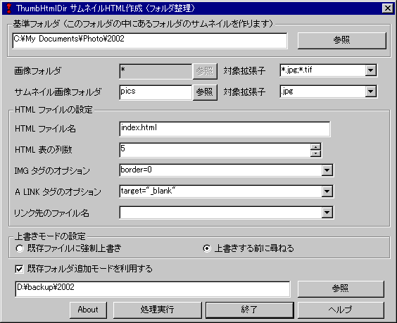
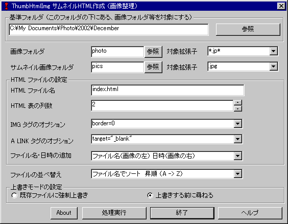

## サムネイルHTML作成<br />Thumbnail HTML creation software for Windows<!-- omit in toc -->


[Home](https://oasis3855.github.io/webpage/) > [Software](https://oasis3855.github.io/webpage/software/index.html) > [Software Download](https://oasis3855.github.io/webpage/software/software-download.html) > [image-tools](../README.md) > ***thumbnail-html-win*** (this page)

<br />
<br />

Last Updated : May. 2003 -- ***this is discontinued software 開発終了***


- [ソフトウエアのダウンロード](#ソフトウエアのダウンロード)
- [機能の概略](#機能の概略)
- [動作環境](#動作環境)
- [インストール](#インストール)
- [アンインストール](#アンインストール)
- [画面構成と利用法](#画面構成と利用法)
- [具体例](#具体例)
- [バージョン履歴](#バージョン履歴)
- [ライセンス](#ライセンス)

<br />
<br />

## ソフトウエアのダウンロード

-    [このGitHubリポジトリを参照する](../thumbnail-html-win/) 


## 機能の概略
フォルダにまとめられた画像ファイルのサムネイルHTMLを作成できます
撮影した写真の整理に、HTML編集ソフトで編集する下準備として利用できます

- ThumbHtmlDir は 複数のフォルダの（フォルダ選択のための）サムネイルを作ります
- ThumbHtmlImg は 一つのフォルダ内の画像ファイルのサムネイルを作ります

## 動作環境
- Windows 95/98/Me/NT/2000/XP (日本語版および各国語版)
- MFC42.DLL および MSVCRT.DLL がシステムフォルダに存在すること（Visual C++ 6.0 対応版） 古いバージョンのDLLの場合、起動できません

このプログラムには、日本語と英語の２種類の設定が含まれています。日本語以外のWindowsで起動した場合、自動的に英語モードで動作します

- ソースコードはVisual C++でビルド可能

## インストール
インストール不要。

配布exeファイルを実行するのみで即利用可能.

## アンインストール
このプログラムは、レジストリおよび設定ファイルなどを利用しません。
プログラム本体を消去すればそれで終わりです。

## 画面構成と利用法





「基準フォルダ」

>このフォルダに HTML ファイルを作成します。画像はこのフォルダの下のサブフォルダに格納されている必要があります
>
>末尾に「￥」記号がつく形で指定します
>
>(例) C:\My Documents\

「画像フォルダ」

>   基準フォルダ以下の全てのフォルダを対象とします。設定変更不可

「画像フォルダの対象拡張子」

>   対象ファイルの検索パターンを入力します
>
>   複数のパターンを検索する場合は、セミコロンで区切ります
>
>   (例) *.jpg;*.gif

「サムネイル画像フォルダ」

>   基準フォルダの下にあるサムネイル画像（縮小）ファイルのあるフォルダ
>
>   相対パスで指定します
>
>   画像フォルダの中の一番『若い名前』のファイルのコピー先となります
>
>   ※ 本プログラムではこのフォルダは検査しません。ブラウザで表示するまでに、縮小画像を用意してください

「サムネイル画像フォルダの対象拡張子」

>   対象ファイルの拡張子を入力します
>
>   複数のパターンや、検索フィルタは設定できません
> 
>   本プログラム実行後、サムネイルフォルダの画像を縮小し、この拡張子に統一してください
> 
>   (例) .jpg

「HTML ファイル名」

>   出力する ＨＴＭＬ ファイル名
> 
>   (例) index.html

「HTML 表の列数」

>   横何列に画像を並べるか指定します （1 ～ 10 列）

「IMG タグのオプション」

>   `````` の 「XXXXX」の指定が出来ます
> 
>   (例) border=0

「A LINK タグのオプション」

>   ```<a href="..." XXXXXX>``` の 「XXXXX」の指定が出来ます
> 
>   (例) target=_new

「リンク先のファイル名」

>   ```<a href="..../index.html">``` のようにフォルダ内のファイルをリンク先を指定できます
> 
>   (例) index.html

「上書きモード」

>   既存のファイルに上書きする場合に警告するかどうかを設定します

「既存フォルダ追加モード」

>   CD-ROMなどに退避した画像集に追加書き込みする場合に指定します
> 
>   (例)
> 
> 既存フォルダ以下に - [Folder 1], [Folder 2], [Folder 3]、 親フォルダ以下に - [Folder 3], [Folder 4], [Folder 5] となっていた場合、[Folder 3] は重複していますのでエラーとなります

「About」

>   バージョンダイアログを表示します

「実行」

>   HTML を作成します

## 具体例
```
    [C:]
      |
      +--[Folder1]
      |
      +--[Folder2]
      |         |
      |         +--[Folder-X1]
      |         |       +--DSCF001.JPG  : 1600x1200のデジカメ画像
      |         |       +--DSCF002.JPG  : 1600x1200のデジカメ画像
      |         |
      |         +--[Folder-X2]
      |         |       +--DSCF001.JPG  : 1600x1200のデジカメ画像
      |         |       +--DSCF002.JPG  : 1600x1200のデジカメ画像
      |         |
      |         +--[Folder-X3]
      |         |       +--DSCF001.JPG  : 1600x1200のデジカメ画像
      |         |       +--DSCF002.JPG  : 1600x1200のデジカメ画像
      |         |
      |         +--[pics]
      |         |       +--Folder-X1.JPG  : ※160x120のサムネイル画像
      |         |       +--Folder-X2.JPG  : ※160x120のサムネイル画像
      |         |       +--Folder-X3.JPG  : ※160x120のサムネイル画像
      |         +--index.html             : ※HTMLファイル
```
-  基準フォルダ           ： C:\Folder2\
-  画像フォルダ           ： *
-  (対象拡張子）          ： *.jpg
-  サムネイル画像フォルダ ： pics
-  (対象拡張子）          ： .jpg
-  HTML ファイル名        ： index.html

  ※のファイルは、各フォルダの中の先頭のファイルがコピーされる

  作成される HTML ファイルの例

```
        +-----------+-----------+-----------+
        |           |           |           |
        | 画像      | 画像      | 画像      |
        | Folder-X1 | Folder-X2 | Folder-X3 |
        +-----------+-----------+-----------+
        |           |           |           |
```
  ※ 基準フォルダは絶対パス、画像・サムネイルフォルダは相対パス

## バージョン履歴
- Version 1.0  (2001/09/15)
  - 当初バージョン
- Version 1.5  (2003/05/11)
  - 標準設定のドロップダウンリスト
  - フォルダ選択の記憶化
  - ヘルプファイル

## ライセンス

このソフトウエアは [GNU General Public License v3ライセンスで公開する](https://gpl.mhatta.org/gpl.ja.html) フリーソフトウエア

※ 配布ソースコード等に書かれているライセンス条項は撤回し、上述GNU General Public License v3ライセンスにて配布する。
