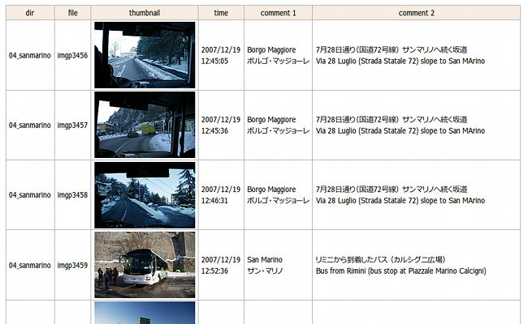
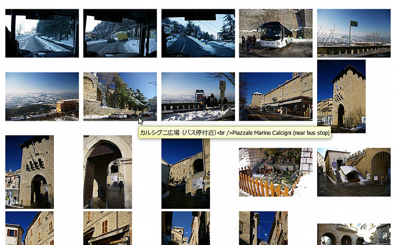
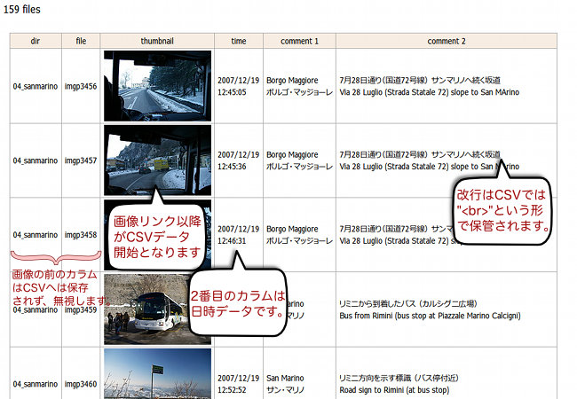

## サムネイルHTML作成スクリプト<br />Thumbnail HTML creation software for Linux and BSD<!-- omit in toc -->


[Home](https://oasis3855.github.io/webpage/) > [Software](https://oasis3855.github.io/webpage/software/index.html) > [Software Download](https://oasis3855.github.io/webpage/software/software-download.html) > [image-tools](../README.md) > ***thumbnail-html*** (this page)

<br />
<br />

Last Updated : Jan. 2012

- [ソフトウエアのダウンロード](#ソフトウエアのダウンロード)
- [機能の概要](#機能の概要)
  - [指定したディレクトリ内の画像ファイル一覧のサムネイルHTMLを作成する](#指定したディレクトリ内の画像ファイル一覧のサムネイルhtmlを作成する)
  - [指定したディレクトリ内の「すべてのサブディレクトリ」の見出し的サムネイルHTMLを作成する機能](#指定したディレクトリ内のすべてのサブディレクトリの見出し的サムネイルhtmlを作成する機能)
- [作成されるサムネイルHTMLファイルの例](#作成されるサムネイルhtmlファイルの例)
  - [行形式（1画像 1行の形式）の出力例](#行形式1画像-1行の形式の出力例)
  - [グリッド形式の出力例](#グリッド形式の出力例)
- [CSV相互変換機能](#csv相互変換機能)
  - [HTMLからCSVに変換するときの注意点](#htmlからcsvに変換するときの注意点)
- [動作環境](#動作環境)
- [インストール方法](#インストール方法)
- [バージョン履歴](#バージョン履歴)
- [ライセンス](#ライセンス)

<br />
<br />

## ソフトウエアのダウンロード

-    [このGitHubリポジトリを参照する](../thumbnail-html/) 

-    [Google Codeよりダウンロード](https://code.google.com/archive/p/thumbnail-html/downloads)（バックアップ サイト 2015年8月更新停止） 

## 機能の概要

画像ファイル（デジタルカメラの写真画像）のサムネイルHTMLファイルを作るプログラムです。

デジカメで撮影した画像ファイルを管理するためのインデックス作成、指定したファイルのみ抽出してアルバム作成を主目的として作成したスクリプトです。

作成したHTMLファイルに、画像の説明文を書き込んで保存したものを、再び「サムネイルHTML作成スクリプト」で読み込んで、画像追加・削除の更新を行うことができます。（書き込まれた説明文はすべて維持されます）

CSVファイルへのコンバート、CSVファイルからHTMLへのコンバートを用いて他の画像管理ソフトとの連携も可能になっています。

### 指定したディレクトリ内の画像ファイル一覧のサムネイルHTMLを作成する

```
 [カレント ディレクトリ]
   |
   +--[指定したディレクトリ]
         |
         +--[縮小サムネイル画像dir]  ← スクリプトにより新規作成される
         |    +-- 001.jpg   ← 縮小版画像として新たに作られる
         |    +-- 002.jpg
         |    +-- 003.jpg
         |    + ...
         |
         +-- 001.jpg   ← 対象画像 001.jpg ～ xxx.jpg
         +-- 002.jpg
         +-- 003.jpg
         + ...
```

### 指定したディレクトリ内の「すべてのサブディレクトリ」の見出し的サムネイルHTMLを作成する機能

```
 [カレント ディレクトリ]
   |
   +--[縮小サムネイル画像dir]  ← スクリプトにより新規作成される
   |    +-- dir_a.jpg   ← 縮小版画像として新たに作られる
   |    +-- dir_b.jpg
   |    +-- dir_c.jpg
   |    + ...
   +--[dir_a]
   |     |
   |     +-- 001.jpg   ← 対象画像 001.jpg ～ xxx.jpg
   |     +-- 002.jpg
   |     +-- 003.jpg
   |     + ...
   |
   +--[dir_b]
   |     |
   |     +-- 001.jpg   ← 対象画像 001.jpg ～ xxx.jpg
   |     +-- 002.jpg
   |     +-- 003.jpg
   |     + ...
   |
   | ...
```


## 作成されるサムネイルHTMLファイルの例

### 行形式（1画像 1行の形式）の出力例

行形式は「サムネイルHTML作成スクリプト」で再読み込みに対応している。また、CSV形式に変換することも可能。



### グリッド形式の出力例

グリッド形式は再読み込みできない。



##  CSV相互変換機能 

行形式のサムネイルHTMLファイルとCSVは、データ欠落を起こさずに相互に変換が可能。



このサムネイルHTMLファイルと、次のCSVは相互変換したもの

```HTML
04_sanmarino/imgp3456.jpg,pics-04/imgp3456.jpg,1198035900,"Borgo Maggiore<br>ボルゴ・マッジョーレ","7月28日通り（国道72号線） サンマリノへ続く坂道<br>Via 28 Luglio (Strada Statale 72) slope to San MArino"
04_sanmarino/imgp3457.jpg,pics-04/imgp3457.jpg,1198035900,"Borgo Maggiore<br>ボルゴ・マッジョーレ","7月28日通り（国道72号線） サンマリノへ続く坂道<br>Via 28 Luglio (Strada Statale 72) slope to San MArino"
04_sanmarino/imgp3458.jpg,pics-04/imgp3458.jpg,1198035960,"Borgo Maggiore<br>ボルゴ・マッジョーレ","7月28日通り（国道72号線） サンマリノへ続く坂道<br>Via 28 Luglio (Strada Statale 72) slope to San MArino"
04_sanmarino/imgp3459.jpg,pics-04/imgp3459.jpg,1198036320,"San Marino<br>サン・マリノ","リミニから到着したバス （カルシグニ広場）<br>Bus from Rimini (bus stop at Piazzale Marino Calcigni)"
04_sanmarino/imgp3460.jpg,pics-04/imgp3460.jpg,1198036320,"San Marino<br>サン・マリノ","リミニ方向を示す標識 （バス停付近）<br>Road sign to Rimini (at bus stop)"
04_sanmarino/imgp3461.jpg,pics-04/imgp3461.jpg,1198036380,"San Marino<br>サン・マリノ","西方向の景色 （バス停付近より）<br>West view from bus stop"
```

###  HTMLからCSVに変換するときの注意点

HTMLファイル中のテーブル構造の ```<tr> … … </tr>``` をCSVデータの1行に対応させます。 ```<td> … … </td>``` で囲まれた中を1データとして、 ```<a herf="...">``` が出現したところから1行の最初のデータが始まるとします。

1行の最初のデータとなる画像リンクの形式は、 ```<a href="..."></a>``` のように、リンクの中に画像が入れ子になっている形状となっている必要があります。

画像リンクの次に、日時データが来る必要があります。形式は YYYY/MM/DD
HH:MM という形式で、CSVへはUNIX秒が格納される形になります。 

## 動作環境

- Perl (Linux/BSD) または Active Perl (Windows)
- ソースコードのuse library;行で指定されているCPANライブラリ 

##  インストール方法 

サムネイルHTML作成スクリプトは、Linuxで利用する場合は配布したファイルをそのまま利用できる。

WindowsのActive Perlで実行する場合、画面表示の文字コードに対応するためソースコード先頭部分をつぎのように変更

```Perl
my $flag_os = 'windows';  # linux/windows
my $flag_charcode = 'shiftjis';     # utf8/shiftjis
```

## バージョン履歴

- Version 1.0（Linux/BSD版） 2010/06/18

    Linux版公開 

- Version 1.1（Linux/BSD版） 2010/11/23

    - 複数ディレクトリ対応 
    - HTMLにスタイルシート適用 

- Version 1.2（Linux/BSD版） 2010/12/16

    - 既存HTMLファイルのアップデート機能追加 
    - 既存HTMLファイル上書き時のバックアップ作成 
    - Windows Active Perl対応の為の微修正 

- Version 1.3（Linux/BSD版） 2011/01/09

    - グリッド形式をtableからカラム数可変のdivに変更 
    - utf8完全対応。ShiftJIS等の他エンコードの読み込み対応 
    - Windows ActivePerl対応 
    - サムネイルディレクトリ作成場所を、画像ディレクトリ下に変更 
    - Exif回転情報によるサムネイル自動回転 
    - 既存HTML読み込み情報の限定化も選択可能 

- Version 1.4（Linux/BSD版） 2011/06/26

    - HTMLからCSV、CSVからHTMLの相互変換機能実装 
    - グリッド形式でComment1でソートしh3セクションとして独立させる機能 

- Version 1.5（Linux/BSD版） 2012/01/14

    - utf8以外のファイル対応 
    - エスケープ文字対応 
    - 文字コード判定バグ修正 
    - 日時ソートバグ修正 
    - lightbox対応a linkにrelとtitleタグ挿入 
    - exif回転情報読み込みバグ修正 
    - exif日時読み込みDateTimeOriginalを次候補にする 
    - grid-style時にHTML末尾にCSVデータを付加 

## ライセンス

このスクリプトは [GNU General Public License v3ライセンスで公開する](https://gpl.mhatta.org/gpl.ja.html) フリーソフトウエア

